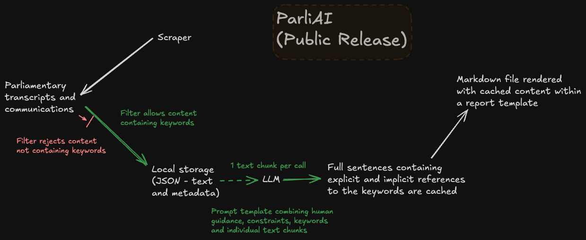

<!--- Badges start --->
 <a href="https://codecov.io/gh/datasciencecampus/parliai-public" > </a>

<!--- Badges end --->


# ParliAI (Public edition)

# Introduction
## About
This is the open-source code repository for the internal ParliAI project, allowing other developers to replicate non-sensitive features of the project and to encourage future collaboration and development in this space. Please do contact us at [datasciencecampus@ons.gov.uk](datasciencecampus@ons.gov.uk) to discuss this or any of our other projects.

## Installation

This demo is tested on the Gemma (1st release) model. It assumes that [Ollama](https://www.ollama.com) has been installed locally and the required model has been downloaded before using ParliAI. This is very easy to do and versions are available for Mac OS, Windows and Linux. For further information on installation and model downloads, you might like to refer to the [Ollama GitHub page](https://github.com/ollama/ollama).

Internally, we have tended to use the Vertex AI microservice in Google Cloud Platform (GCP) to access both the Gemini and Gemma family of Large Language Models. However, Ollama gives free access to Gemma and doesn't require others to have a GCP account and architecture. We hope to add the feature back to the public repo to support developers who already have GCP access.

You are strongly recommended to install project resources into a virtual environment. Project setup can be achieved as follows:

``` bash
$ git clone https://github.com/datasciencecampus/parliai-public.git
$ cd parliai-public
$ python -m venv venv
$ source venv/bin/activate
$ python -m pip install --upgrade pip
$ python -m pip install .
```

> \[!NOTE\] If you intend on doing any development work, please install the package as editable (`-e`) and with the `dev` optional dependencies:
>
> ``` bash
> $ python -m pip install -e ".[dev]"
> ```
>
> Moreover, once you have installed the package, please install the pre-commit hooks. These hooks help us to ensure repository security and a consistent code style.

### Pre-commit actions
This repository contains a configuration of pre-commit hooks. These are language agnostic and focussed on repository security (such as detection of passwords and API keys). If approaching this project as a developer, you are encouraged to install and enable `pre-commits` by running the following in your shell:
   1. Install `pre-commit`:

      ```
      pip install pre-commit
      ```
   2. Enable `pre-commit`:

      ```
      pre-commit install
      ```
Once pre-commits are activated, whenever you commit to this repository a series of checks will be executed. The pre-commits include checking for security keys, large files and unresolved merge conflict headers. The use of active pre-commits are highly encouraged and the given hooks can be expanded with Python or R specific hooks that can automate the code style and linting. We are using `ruff` to ensure consistent Python code formatting.

**NOTE:** Pre-commit hooks execute Python, so it expects a working Python build.

## Usage
[theyworkforyou.com](https://www.theyworkforyou.com)

By default, parliamentary content from the previous day (and anything so far on the current day) will be reviewed. However, a number of flags are available for use from the command line. The main time filtering behaviours can be summarised as follows:

- previous day (default) e.g.

``` bash
$ python scripts/theyworkforyou.py
```

- specify day with optional end date (`-d` or `--end`) e.g.

``` bash
$ python scripts/theyworkforyou.py -d 2024-05-20
```

- range from start date (`-s` or `--start`) to end date e.g.

``` bash
$ python scripts/theyworkforyou.py -s 2024-05-20 -d 2024-05-24
```

- look behind from end date (optional) by a specified window of days (inclusive; `-n` or `--window`) e.g.

``` bash
$ python scripts/theyworkforyou.py -d 2024-05-24 -n 3
```

Additionally, the `-w` or `--weekly` flag can be used to generate a report for the previous week e.g. a Wednesday to a Wednesday. The `-f` or `--form` flag can also be applied to specify a preferred date format (other than the default of %Y-%m-%d).

### Workflow



# Data Science Campus
At the [Data Science Campus](https://datasciencecampus.ons.gov.uk/about-us/) we apply data science, and build skills, for public good across the UK and internationally. Get in touch with the Campus at [datasciencecampus@ons.gov.uk](datasciencecampus@ons.gov.uk).

# License

<!-- Unless stated otherwise, the codebase is released under [the MIT Licence][mit]. -->

The code, unless otherwise stated, is released under [the MIT Licence][mit].

The documentation for this work is subject to [© Crown copyright][copyright] and is available under the terms of the [Open Government 3.0][ogl] licence.

[mit]: LICENCE
[copyright]: http://www.nationalarchives.gov.uk/information-management/re-using-public-sector-information/uk-government-licensing-framework/crown-copyright/
[ogl]: http://www.nationalarchives.gov.uk/doc/open-government-licence/version/3/
